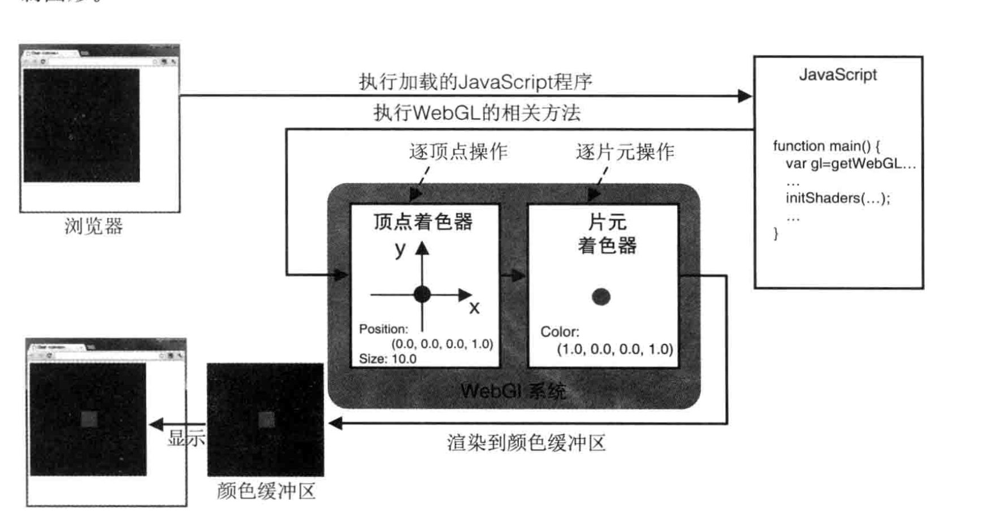
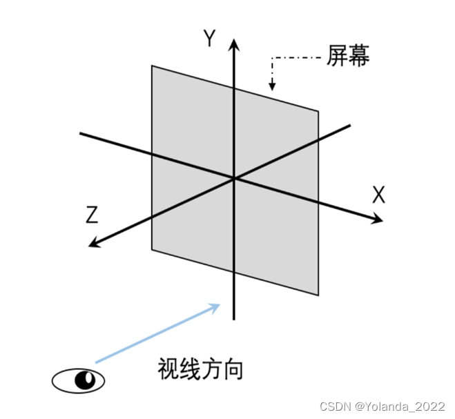
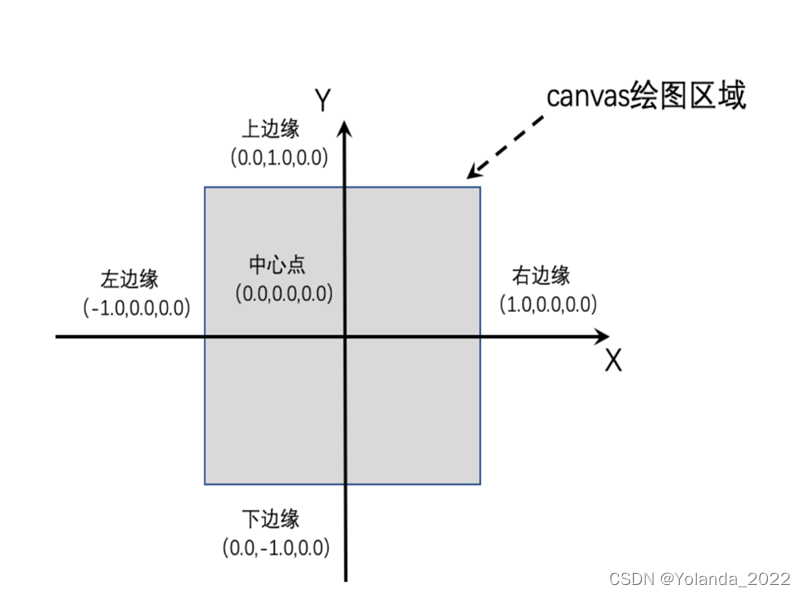
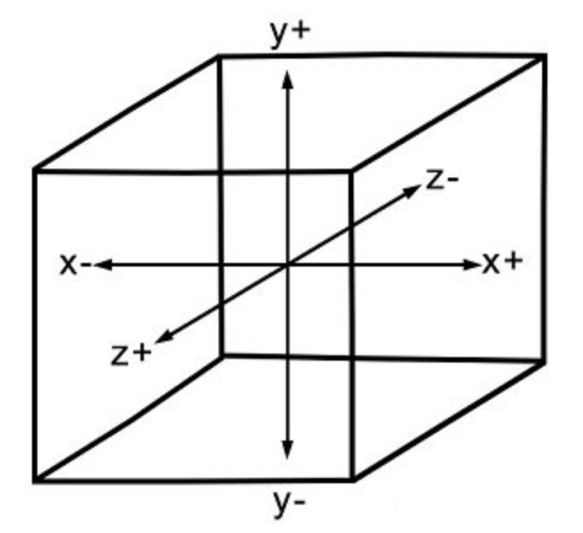

# 计算机图形WEBGL技术分享 

### 简介：

计算机图形 ： [计算机图形](https://vibaike.com/197961/)处理借助[计算机生成图像](https://vibaike.com/138205/)，就是利用计算机去渲染图形或者视频模型等。

应用领域：比如 游戏，数字摄影，3d，vr，ar等一些虚拟场景开发。

内容 ： 计算机图形学的一些主题包括[用户界面设计](https://vibaike.com/106281/)、[精灵图](https://vibaike.com/198015/)形、渲染、[光线追踪](https://vibaike.com/113234/)、几何处理、[计算机动画](https://vibaike.com/111596/)、矢量图形、3D 建模、着色器、隐式曲面、[可视化](https://vibaike.com/197956/)、科学计算、图像处理、可视化、计算几何等。 整体方法在很大程度上取决于几何学、[光学](https://vibaike.com/3134/)、物理学和感知等基础科学。

类型：计算机图形只是应用程序编程接口api开发，应用程序编程接口 意思是只是调用显卡提供的 api 开发不需要买显卡，也没办法操作显卡指令和驱动显卡。所以计算机图形只能算是api开发。其实不管web前端还是服务器他们都是 api 开发，更底层一点的 就是 嵌入式开发，更底层就是 内核开发。

底层语言：opengl

​       

计算机视觉：计算机视觉就是利用计算机深度学习和几何方法，让计算机能够识别和猜测出图形的位置或者物体的一个计算， 比如让计算机视频一张图片包含哪些信息人物问题等。  

应用领域：基于深度学习的：文字识别、图像识别、人脸识别、视频内容理解、医疗影像诊断、神经网络芯片、驾驶辅助等。 基于几何方法的：虚拟现实、增强现实、三维重建、机器人、无人机、无人驾驶等。

当然如果要学习计算机视觉，除了要学习ai 深度学习知识以外还要学习计算机图形，可以说计算机视觉知识点是包含了计算机图形的知识点。

类型：计算机视觉比计算机图形开发复杂很多，这个需要了解到显卡底层硬件知识，并且了解显卡底层指令才能开发。

底层语言：OpenCV

我们今天主要是讲计算机图形，所以不会涉及到计算机视觉。


## 计算机图形底层API以及一些语言平台

### WebGL简介：

webgl是一种3D绘图协议，衍生于 [OpenGL](https://so.csdn.net/so/search?q=OpenGL&spm=1001.2101.3001.7020) ES2.0，可以结合 Html5 和 JavaScript 在网页上绘制和渲染二/三维图形。
WebGL api 提供三维绘图的方式
图形的绘制主要通过 WebGLRenderingContext 接口完成

### WebGL的优势：

内嵌在浏览器中，不需要安装任何插件即可运⾏；
只需要⼀个⽂本编辑器和浏览器，就可以编写三维图形程序，学习和使用比较简单 


其他计算机图形参考资料 ：https://en.wikipedia.org/wiki/List_of_3D_graphics_libraries


## 学习计算机图形需要具备知识

入门到中级：线性代数，解析几何。(必须)  ，虽然不需要这两个课程非常厉害，但是需要会这两门课程。比如可以先学习一部分这两门课程，然后再来学习webgl。等到好多webgl代码不理解时候再来补习这两门课程。

高级:除了上面两门课程以为，如果到了高级开发，我们要做一些非常炫酷的效果的时候可能需要用到一些 微积分，和积分几何。


## 学习这门课程的体会与心得

   我个人学习这门课程感觉到比较抽象，还有理论性 比较多，比如几十行代码，需要理解透，可能需要学习好几个小时的线性代数和解析几何并且理解线性代数和解析几何，再去理解代码才变得没这么吃力。而且有一定复杂度，这门课程api也不少，并且很多api和多线性矩阵和行列式相乘就变得非常复杂。并且这门课程不好调试，不好打断点。所以给学习和开发者带来了一定的麻烦。并且很多想要实现的功能资料并不多，就算有很多也是需要理解才行。

  当然以上困点都是靠编程和学习知识点来积累解决，都是要靠时间一点点积累，所以需要花一定时间来学习这门课程。并没有更快的捷径。


## 学习资料

书本:《WebGL编程指南》  

WebGL 在线教程:  https://webglfundamentals.org/     


## Code 代码演示:

### 演示代码

#### github地址 ：https://github.com/ygs-code/webgl-lesson

### 01第一个webgl程序 ，清空画布

首先webgl是要依赖浏览器执行的一个应用程序软件

所以需要建立一个html文件

```
<!DOCTYPE html>
<html lang="en">
    <head>

        <meta charset="utf-8" />
        <link rel="icon" href="%PUBLIC_URL%/favicon.ico" />
        <meta name="viewport" content="width=device-width, initial-scale=1" />
        <meta name="theme-color" content="#000000" />
        <meta
            name="description"
            content="Web site created using create-react-app"
        />
    </head>
    <script  src="./index.js" />
    <body>
  
    </body>
</html>

```

然后需要一个js

```
import "./index.less";

window.onload = function () {
  const canvas = document.createElement("canvas");
  document.body.appendChild(canvas);
  canvas.width = 500;
  canvas.height = 500;
  if (!canvas.getContext) return;
  let gl = canvas.getContext("webgl");
  // vertexShader, fragmentShader
  // program

  // 使用完全不透明的黑色清除所有图像
  // 清空掉颜色
  gl.clearColor(1, 0, 0, 1); // RBGA
  // 用上面指定的颜色清除缓冲区
  gl.clear(gl.COLOR_BUFFER_BIT);
};

```


## 渲染管线 GLSL

 webgl 需要做一个点的渲染，也是比较麻烦的，他不像html5 canvas 2d渲染这么简单， webgl 做渲染需要用到

JavaScript ，和 GLSL语言，glsl  shader 是 vertex shader 和   fragment shader 组成 。

### 什么是shader

所谓shader中文叫做着色器，它实际上是给用户一种方式来介入GPU渲染流程，定制gpu如何组织数据和绘制数据到屏幕上。

一般来说着色器会分为顶点着色器和片元着色器。他们有着不同的功能和作用。

### 顶点着色器 Vertex Shader

顶点着色器主要负责处理顶点数据，其实顶点着色器能做的事情并不多，大部分就是在处理顶点的矩阵变换，将顶点的位置通过MVP矩阵乘法最终变换到裁剪空间。

顶点着色器:顶点着色器是用来描述顶点的特性，(如位置，颜色等)的程序，顶点是指的是二维和三维空间的一个点，比如二维或三维图形的端点或交点。

**输入**：顶点着色器的输入数据一般是我们传入的`attribute`、`uniforms`变量。

**输出**：一般顶点着色器的运算结果输出是设置`gl_Position`，也可以设置一些变量比如`gl_PointSize`或者 `varying`变量

Vertex Shader 在显卡中渲染流程图

这里的9表示“处理9个顶点”，所以将会有9个顶点被转换。


### 片元着色器fragment Shader

片元着色器在整个渲染中起到了非常大的作用，一般颜色，贴图采样，光照，阴影等计算都会在片元着色器中计算。

片元着色器：进行逐片元处理过程如光照，的程序，片元是webgl的一个术语，你可以理解为像素，图像的单元。

**输入**：片元着色器的输入数据一般是我们从顶点着色器传入的`varying`或者全局的`uniforms`变量。

**输出**：一般片元着色器的运算结果输出是设置`gl_FragColor`

fragment Shader 在显卡中工作渲染图


<iframe src="https://webglfundamentals.org/webgl/lessons/resources/fragment-shader-anim.html?cid=8B504C1595CD3973&resid=8B504C1595CD3973%2126382&authkey=AJzDcN30q6g4W0Y&em=2" width="700px" height="250px" frameborder="0" scrolling="no"> </iframe>


简单的说，在三维场景中，仅仅用线条和颜色把图形画出来是远远不够的，必须要考虑，比如画上去之后，或者观察者的视角发生变化，对场景会有哪些影响，着色器可以高度灵活的完成这项工作，提供各种渲染效果。


实际上 JavaScript运行webgl 是调用了opengl 底层代码   Shader GLSL 语言来执行渲染的。他们的关系是以下图。




 

### shader是如何运行的

想要了解shader是如何运行的，我们就要先知道整个webgl的运行机制。webgl的一次绘制，需要经过大致的以下几个阶段。

- 创建webgl的应用程序Program，从文本编译并使用shader
- 将三维几何数据通过attribute传送给GPU
- GPU执行顶点着色器，处理顶点数据
- GPU执行片元着色器，处理颜色等数据
- 将执行结果写入缓冲区（用于显示到屏幕或者后处理）

我们可以看到，shader的执行是需要链接、编译后执行的，所以shader在运行时其实本身是不能修改的，但是我们可以修改一些数据参数值。


编译GLSL ES代码，创建和初始化着色器供WebGL使用。具体分为以下7个步骤：

（1）创建着色器对象（gl.createShader()）

（2）向着色器对象中填充着色器程序的源代码（gl.shaderSource()）

（3）编译着色器（gl.compileShader()）

（4）创建程序对象（gl.createProgram()）

（5）为程序对象分配着色器（gl.attachShader()）

（6）链接程序对象（gl.linkProgram()）

（7）使用程序对象（gl.useProgram()）

在这里出现了两种对象：着色器对象（shader object）和程序对象（program object）。

着色器对象：着色器对象管理一个顶点着色器或一个片元着色器。每一个着色器都有一个着色器对象。

程序对象：程序对象是管理着色器对象的容器。WebGL中，一个程序对象必须包含一个顶点着色器和一个片元着色器。


### webgl 程序 执行流程


### 02 绘制一个点

Index.js

```
import "./index.less";
import vertexSource from "./index.vert";
import fragmentSource from "./index.frag";

window.onload = function () {
  const canvas = document.createElement("canvas");
  document.body.appendChild(canvas);
  canvas.width = 500;
  canvas.height = 500;

  if (!canvas.getContext) return;
  let gl = canvas.getContext("webgl");

  // vertexShader, fragmentShader
  // 类似 c 语言的东西
  // 顶点着色器程序
  // let vertexSource = `
  //     void main(){
  //       gl_Position = vec4(0.0, -0.5, 0.0, 1.0);
  //       gl_PointSize = 10.0;
  //     }
  //   `; // glsl

  // // 片元着色器程序
  // let fragmentSource = `
  //     void main(){
  //         gl_FragColor = vec4(0.0, 1.0, 0.0 , 1.0);   
  //     }
  //   `;

  // 真正创建shaser()
  // 创建 vertexShader
  /*
    
    用于创建一个 WebGLShader 着色器对象，
    该对象可以使用 WebGLRenderingContext.shaderSource() 
    和 WebGLRenderingContext.compileShader() 方法配置着色器代码。
    */
  // 创建着色器对象
  let vertexShader = gl.createShader(gl.VERTEX_SHADER);

  // 创建fragmentShader 创建着色器对象
  let fragmentShader = gl.createShader(gl.FRAGMENT_SHADER);

  // 向着色器对象中填充着色器程序的源代码
  gl.shaderSource(vertexShader, vertexSource);
  //向着色器对象中填充着色器程序的源代码
  gl.shaderSource(fragmentShader, fragmentSource);
  //

  //编译着色器
  gl.compileShader(vertexShader);
  //编译着色器
  gl.compileShader(fragmentShader);

  // program
  // 讲两个Shader连接合在一起
  // 创建程序对象
  let program = gl.createProgram();
  // 为程序对象分配着色器
  gl.attachShader(program, vertexShader);
  gl.attachShader(program, fragmentShader);

  // 链接程序对象
  gl.linkProgram(program);
  // 使用程序对象
  gl.useProgram(program);

  // 第一步清空这个画布
  gl.clearColor(0.5, 0.5, 0.5, 1.0); // rgba()
  // 真正清空颜色 并填充为黑色

  //gl.COLOR_BUFFER_BIT  webgl 常量api
  gl.clear(
    // 指定颜色缓存
    gl.COLOR_BUFFER_BIT
  );

  // 画一个点
  gl.drawArrays(gl.POINTS, 0, 1);
};

```


####  vertex Shader 顶点着色器

```
 void main(){
        gl_Position = vec4(0.0, -0.5, 0.0, 1.0);
        gl_PointSize = 10.0;
      }
```


#### fragment Shader  片元着色器 

```
  void main(){
          gl_FragColor = vec4(0.0, 1.0, 0.0 , 1.0);   
  }
```


### 03.initShaders封装

刚才我们已经学会了webgl基本程序代码，如何写 Shader  调用gpu渲染。其实对于webgl语言来 说编译GLSL ES代码，创建和初始化着色器供WebGL使用 这段代码都是一样，每个程序都是这样子，所以这块我们可以把他抽离出来

initShader.js

```
function loadShader(gl, type, source) {
  console.log("loadShader");
  // Create shader object
  // 创建着色器对象
  var shader = gl.createShader(type);
  if (shader === null) {
    console.error("unable to create shader");

    throw "unable to create shader";
    // return null;
  }

  // Set the shader program
  // 向着色器对象中填充着色器程序的源代码
  gl.shaderSource(shader, source);

  // Compile the shader
  //编译着色器
  gl.compileShader(shader);

  // Check the result of compilation
  //检查编译结果
  var compiled = gl.getShaderParameter(shader, gl.COMPILE_STATUS);
  if (!compiled) {
    // 检查如果有报错
    var error = gl.getShaderInfoLog(shader);
    // 输出报错日志
    console.error("Failed to compile shader: " + error);

    // 删除shader 防止内存溢出
    gl.deleteShader(shader);
    throw "Failed to compile shader: " + error;
  }

  return shader;
}

function createVertexShader(gl, program, vshader) {
  // 创建vertexShader
  var vertexShader = loadShader(gl, gl.VERTEX_SHADER, vshader);
  // 为程序对象分配着色器
  gl.attachShader(program, vertexShader);
  return vertexShader;
}

function createFragmentShader(gl, program, fshader) {
  // 创建fragmentShader
  var fragmentShader = loadShader(gl, gl.FRAGMENT_SHADER, fshader);
  // 为程序对象分配着色器
  gl.attachShader(program, fragmentShader);
  return fragmentShader;
}

function createProgram(gl, vshader, fshader) {
  // Create shader object
  // 创建vertexShader
  // var vertexShader = loadShader(gl, gl.VERTEX_SHADER, vshader);
  // // 创建fragmentShader
  // var fragmentShader = loadShader(gl, gl.FRAGMENT_SHADER, fshader);
  // if (!vertexShader || !fragmentShader) {
  //   return null;
  // }

  // Create a program object
  // 将两个Shader连接合在一起
  // 创建程序对象
  var program = gl.createProgram();
  if (!program) {
    return null;
  }
  // 创建vertexShader
  var vertexShader = createVertexShader(gl, program, vshader);
  // 创建fragmentShader
  var fragmentShader = createFragmentShader(gl, program, fshader);
  if (!vertexShader || !fragmentShader) {
    return null;
  }

  // Attach the shader objects
  // 为程序对象分配着色器
  // gl.attachShader(program, vertexShader);
  // gl.attachShader(program, fragmentShader);

  // Link the program object
  // 链接程序对象
  gl.linkProgram(program);

  // Check the result of linking
  // 检查链接结果
  var linked = gl.getProgramParameter(program, gl.LINK_STATUS);
  if (!linked) {
    // 如果有编译错误
    var error = gl.getProgramInfoLog(program);
    console.error("Failed to link program: " + error);

    // 删除program
    gl.deleteProgram(program);
    // 删除 fragmentShader
    gl.deleteShader(fragmentShader);
    // 删除 vertexShader
    gl.deleteShader(vertexShader);
    throw "Failed to link program: " + error;
    // return null;
  }
  return program;
}
function initShaders(gl, vshader, fshader) {
  // gl.viewport(0, 0, gl.canvas.width, gl.canvas.height);
  // 创建Program
  
  var program = createProgram(gl, vshader, fshader);
  if (!program) {
    console.error("Failed to create program");

    throw "Failed to create program";
  }
  // 使用程序对象
  gl.useProgram(program);
  // 挂着对象属性
  // gl.program = program;

  return program;
}

export default initShaders;

```


### 04 gl_Position使用

 vertex Shader 顶点着色器

```
   void main(){
        // vec4 表示是由4位float小数组成
        gl_Position = vec4(
          0.1,  // x 轴
          0.0,  // y轴
          0.0,  // z 轴
          1.0  // 偏移量缩放参数 但这个值最小值不能小于0
          );  // 表示顶点颜色的位置
        gl_PointSize = 10.0;   //w 表示顶点颜色的尺寸，设置越大，这个像素就会越大
      }
```


顶点着色器的任务通常是变换并且输出顶点的坐标(gl_Position)，并且输出其他属性给片段着色器。gl_Position 必须是一个四维的齐次坐标(x, y, z, w)，实际使用时，它代表的通常是(x/w, y/w, z/w)的三维坐标，这是为了绘制 3D 图形时方便处理透视，对于 2D 的绘制来说，通常只需要指定一个固定的 z（例如0.0），并且将 w 指定为 1.0 即可。

w 坐标还会影响光栅化时属性插值的结果，让显示的结果和 3D 透视时一致。对于前三个坐标来说，(x/w, y/w)是个直角坐标系坐标，它决定了顶点在屏幕上显示的位置，(-1, -1)表示视口(viewport)的左下角，(1, 1)表示视口的右上角，(0, 0)是视口正中心。z/w 在开启了深度测试的情况下可以用来判断并裁剪掉被遮挡的部分，在 3D 绘制的时候常用。


#### fragment Shader  片元着色器 

```
 void main(){
          gl_FragColor = vec4(1.0, 1.0, 0.0 , 1.0);    // 颜色rgba
      }
```


片段着色器每个像素调用一次。 每次调用它时，都需要将特殊的全局变量 gl_FragColor 设置为某种颜色。后面我们会举例子。


尝试 改变 gl_FragColor 和   gl_Position 查看效果。


### 05 attribute变量使用

接下来我们来学习一写动态传参。上面我们学习了 Shader  如何使用，但是我们的 gl_Position 和 gl_FragColor参数都是写死的，如果我们需要动态传参，比如要js传递参数到gpu vertex shader 中 的话就需要用到attribute。

attribute 变量只能在顶点着色器中使用，不能在片元着色器中使用

变量声明方法如下：


获取attribute变量


给attribute变量赋值


片段代码

```
attribute vec4 a_Position;// 声明a_Position变量
attribute float a_PointSize;// 声明a_PointSize变量
void main(){
    // vec4 表示是由4位float小数组成
    // 只传递顶点数据
    gl_Position=a_Position;
    // vec4(
        //   0.0,  // x 轴
        //   0.0,  // y轴
        //   0.0,   // z 轴
        //   1.0  // 偏移量缩放参数 但这个值最小值不能小于0
    //   );  // 表示顶点颜色的位置
    gl_PointSize=a_PointSize;//w 表示顶点颜色的尺寸，设置越大，这个像素就会越大
}
```

js

```
  // 设置动态变量
  //获取arrtibute变量
  const a_Position = gl.getAttribLocation(program, "a_Position");
  
  
 let Position = [0.1, 0.0, 0.0, 1.0];
    // // 数组传递
  gl.vertexAttrib3fv(a_Position, new Float32Array(Position));
```


### 06 uniform变量使用

由于attribute 变量只能在顶点着色器中使用，不能在片元着色器中使用，如果需要在片元着色器话我们需要用uniform变量才行。如果我们需要动态传参，比如要js传递参数到gpu vertex shader 或者  fragment shader 

uniform**在vertex和fragment两者之间声明方式完全一样，则它可以在vertex和fragment共享使用。（相当于一个被vertex和fragment shader共享的全局变量）**


添加 uniform 变量，设置到颜色上

获取 uniform 变量存储地址


给uniform 变量赋值


设置精度


片段代码

```
precision mediump float;  // 定义浮点变量
uniform vec4 u_FragColor;  // 定义u_FragColor变量
void main() {
          // gl_FragColor = vec4(1.0, 1.0, 0.0 , 1.0);    // 颜色rgba
    gl_FragColor = u_FragColor;    // 颜色rgba
}
```

js

```
  // 获取Uniform 存储地址
  const u_FragColor = gl.getUniformLocation(program, "u_FragColor");
  if (!u_FragColor) {
    console.log("Failed to get the storage loacation of u_FragColor");
    return false;
  }
  
    gl.uniform4fv(u_FragColor, new Float32Array(rgba));
```


### 07varying变量使用

我们上面已经学会了用attribute变量使用，和uniform变量使用，但是如果要他们vertex shader 和   fragment shader 通信就要用到varying变量使用。

varying变量定义
在WebGL中，varying变量是在顶点着色器和片元着色器之间传递数据的一种特殊类型的变量。它们被用于在顶点着色器和片元着色器之间传递信息，以便在渲染过程中进行插值。在顶点着色器中，varying变量的值被计算并传递到片元着色器中，然后在片元着色器中进行插值，然后被用来确定要绘制的像素的颜色。

 

片段代码 vertex shader 

```
attribute vec4 a_Position;  // 声明a_Position变量
attribute float a_PointSize; // 声明a_PointSize变量
varying vec4 v_Color;  // 声明中间变量 v_Color
void main() {
        // vec4 表示是由4位float小数组成
    gl_Position = a_Position;
    v_Color = a_Position;  // 将a_Position赋值给v_Color
        // vec4(
        //   0.0,  // x 轴
        //   0.0,  // y轴
        //   0.0,   // z 轴
        //   1.0  // 偏移量缩放参数 但这个值最小值不能小于0
        //   );  // 表示顶点颜色的位置
    gl_PointSize = a_PointSize;   //w 表示顶点颜色的尺寸，设置越大，这个像素就会越大
}
```

 fragment shader 

```
precision mediump float;
uniform vec4 u_FragColor;
varying vec4 v_Color;
void main() {
          //gl_FragColor = vec4(1.0, 1.0, 0.0 , 1.0);    // 颜色rgba
          // gl_FragColor = u_FragColor;    // 颜色rgba
    gl_FragColor = v_Color;    // 将 v_Color 值赋值给颜色gl_FragColor
}
```


# WebGL坐标系及基础几何概念

绘图区域

[WebGL](https://so.csdn.net/so/search?q=WebGL&spm=1001.2101.3001.7020)使用的是正交右手坐标系，且每个方向都有可使用的值的区间，超出该矩形区间的图像不会绘制：

- x轴最左边为-1，最右边为1；
- y轴最下边为-1，最上边为1；
- z轴朝向你的方向最大值为1，远离你的方向最大值为-1；

注：这些值与[Canvas](https://so.csdn.net/so/search?q=Canvas&spm=1001.2101.3001.7020)的尺寸无关，无论Canvas的长宽比是多少，WebGL的区间值都是一致的。








### 三、图形绘制与变换

##### 3.1绘制多个点

###### 3.1.1什么是缓冲区对象

如果我们要一次性绘制多个定点要怎么做呢？

WebGL提供了一种很方便的机制，缓冲区对象是WebGL系统中的一块内存区域，可以一次性地向缓冲区对象中填充大量的顶点数据，然后将这些数据保存在其中，供顶点着色器使用。它可以一次性地向着色器传入多个顶点的数据。

使用缓冲区对象向顶点着色器传入多个顶点的数据，需要遵循以下5个步骤：

1. 创建缓冲区对象`gl.createBuffer()`
2. 绑定缓冲区对象`gl.bindBuffer()`
3. 将数据写入缓冲区对象`gl.bufferData()`
4. 将缓冲区对象分配给一个`attribute`变量`gl.vertexAttribPointer()`
5. 开始`attribute`变量`gl.enableVertexAttribArray()`


创建缓冲区对象`gl.createBuffer()`

> 执行该方法的结果就是，WebGL系统中多了一个新创建出来的缓冲区对象。返回值为null表示创建失败。

> 相应地，`gl.deleteBuffer(buffer)`函数可以用来删除被`gl.createBuffer()`创建出来的缓冲区对象

###### 1.创建顶点数据

```
  let vertices = new Float32Array([
    -0.5, -0.5, 
    0.5, -0.5, 
    0.0, 0.5
  ]);
```

2.绑定缓冲区`gl.bindBuffer(target,buffer)`

> 创建缓冲区的第二步就是将缓冲区对象绑定到WebGL系统中已经存在的“目标”上。这个“目标”表示缓冲区对象的用途。允许使用buffer表示的缓冲区对象绑定到target表示的目标上。
>
> 

```
  // 将缓冲区对象绑定指定目标
  gl.bindBuffer(gl.ARRAY_BUFFER, buffer);
```


其中，`gl.ARRAY_BUFFER`表示缓冲区对象中包含了顶点的数据


3.向缓冲区对象中写入数据`gl.bufferData(target,data,usage)`

```
  //3
  // 向缓冲区写入数据
  gl.bufferData(gl.ARRAY_BUFFER, vertices, gl.STATIC_DRAW);

```


该方法的效果是，将第2个参数vertices中的数据写入绑定到第1个参数`gl.ARRAY_BUFFER`上的缓冲区对象。我们不能直接向缓冲区写入数据，而只能向"目标"写入数据，所以要向缓冲区写数据，必须先绑定。


 4: 把带有数据的buffer给arrribute

  // 将缓冲区对象分配给a_Position变量

```
  // 将缓冲区对象分配给a_Position变量
  let a_Position = gl.getContextAttributes(gl.isProgram, "a_Position"); // 获得变量位置
 
  /*
     
     告诉显卡从当前绑定的缓冲区（bindBuffer() 指定的缓冲区）中读取顶点数据。
     方法绑定当前缓冲区范围到gl.ARRAY_BUFFER,
     成为当前顶点缓冲区对象的通用顶点属性并指定它的布局 (缓冲区对象中的偏移量)。

     */
  gl.vertexAttribPointer(
    a_Position, // 变量 指定要修改的顶点属性的索引。
    2, // size 三个数据为一组 告诉三个点位一组颜色  1, 2, 3, or 4. 指定每个顶点属性的组成数量，必须是 1，2，3 或 4。
    gl.FLOAT, //type gl.FLOAT: 32-bit IEEE floating point number 32 位 IEEE 标准的浮点数
    false, // normalized 当转换为浮点数时是否应该将整数数值归一化到特定的范围。
    FSIZE * 2, // stride 以字节为单位指定连续顶点属性开始之间的偏移量 (即数组中一行长度)。不能大于 255。如果 stride 为 0，则假定该属性是紧密打包的，即不交错属性，每个属性在一个单独的块中，下一个顶点的属性紧跟当前顶点之后。
    0 //offset 指定顶点属性数组中第一部分的字节偏移量。必须是类型的字节长度的倍数。
  ); //  告诉gl如何解析数据

```

 上面，我们使用了Float32Array对象，而不是JS更常见的Array对象。这是因为，JS中的数组Array是一种通用的类型，既可以存储数字也可以存储字符串，而并没有对“大量元素都是同一种类型”优化。为了解决这个问题，WebGL引入了**类型化的数组**，Float32Array就是其中之一。

- WebGL使用的各种类型化数组

| 数组类型     | 每个元素所点字节数 | 描述（C语言中的数据类型）        |
| ------------ | ------------------ | -------------------------------- |
| Int8Array    | 1                  | 8位整型（singed char）           |
| UInt8Array   | 1                  | 8位无符号整型（unsinged char）   |
| Int16Array   | 2                  | 16位整型（singed short）         |
| UInt16Array  | 2                  | 16位无符号整型（unsinged short） |
| Int32Array   | 4                  | 32位整型（singed int）           |
| UInt32Array  | 4                  | 32位无符号整型（unsinged int）   |
| Float32Array | 4                  | 单精度32位浮点数（float）        |
| Float64Array | 8                  | 双精度64位浮点数（double）       |

 

- 类型化数组的方法、属性和常量

| 方法、属性和常量  | 描述                                          |
| ----------------- | --------------------------------------------- |
| get(index)        | 获取第index个元素值                           |
| set(index,value)  | 设置第index个元素的值为value                  |
| set(array,offset) | 从第offset个元素开始将数组array中的值填充进去 |
| length            | 数组的长度                                    |
| BYTES_PER_ELEMENT | 数组中每个元素所占的字节数                    |


   // 5.确认 // 启用数据

  // 连接a_Position变量与分配给他的缓冲区对象

```
  // 5.确认 // 启用数据
  // 连接a_Position变量与分配给他的缓冲区对象
  gl.enableVertexAttribArray(a_Position);
```


